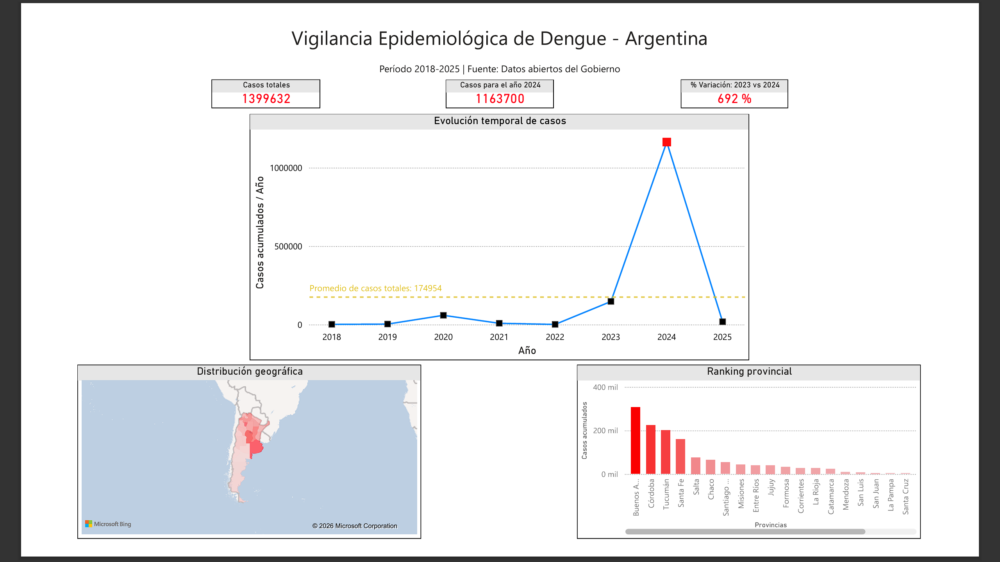
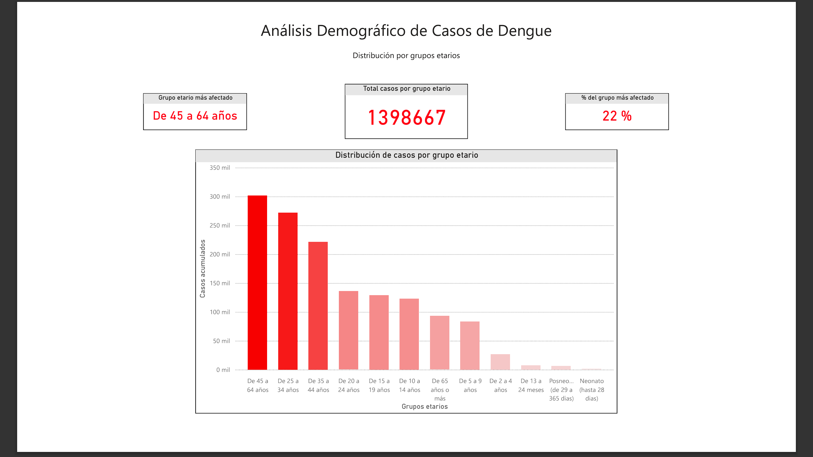
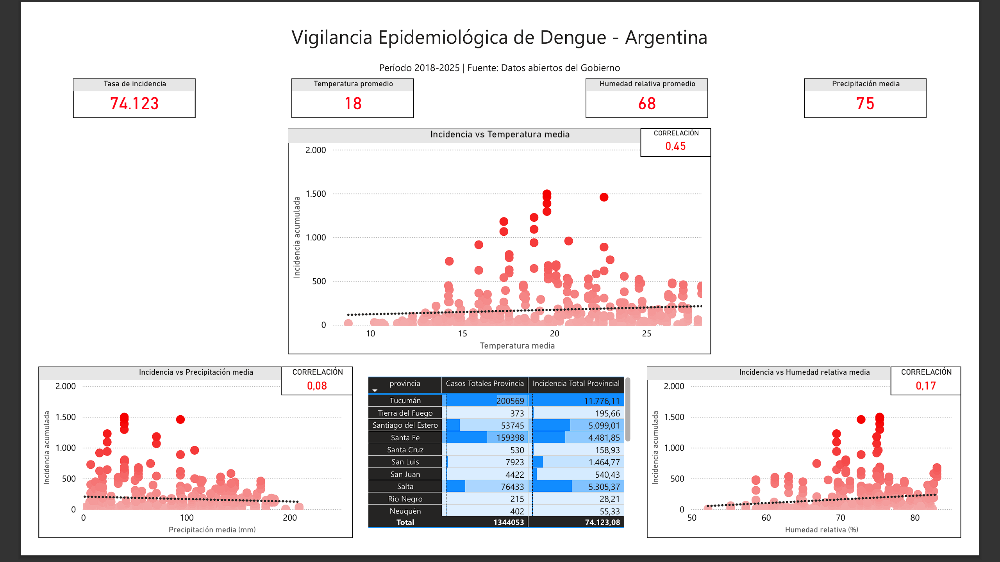
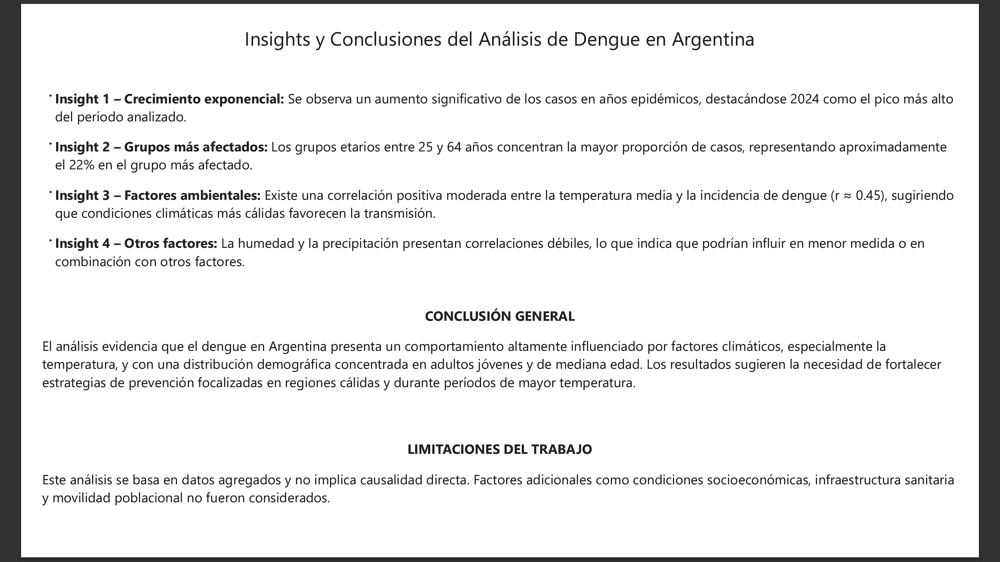

# 🦠 Vigilancia Epidemiológica del Dengue en Argentina  
### Análisis de datos end-to-end: Python + SQL + Power BI

---

## 📌 Descripción

Este proyecto desarrolla un análisis integral del dengue en Argentina, combinando datos epidemiológicos y variables climáticas para identificar patrones, relaciones y tendencias relevantes.

Se implementa un pipeline completo de datos (**end-to-end**) que incluye:

- Limpieza y transformación de datos (Python)  
- Modelado estructurado (SQLite)  
- Visualización e interpretación (Power BI)  

El enfoque integra herramientas de Data Science con criterios epidemiológicos para generar insights aplicables a la salud pública.

---

## 🎯 Objetivos

- Analizar la evolución temporal del dengue en Argentina  
- Identificar patrones espaciales a nivel provincial  
- Evaluar la relación entre variables climáticas e incidencia  
- Construir modelos predictivos  
- Diseñar un dashboard interactivo para análisis en BI  

---

## 🔄 Metodología

**1. Procesamiento de datos (Python)**  
- Limpieza y tratamiento de valores faltantes  
- Transformación de variables  
- Feature engineering (lags, métricas acumuladas, incidencia)

**2. Modelado de datos (SQLite)**  
- Creación de vistas analíticas  
- Uso de funciones de ventana (LAG)  
- Estandarización de métricas epidemiológicas  

**3. Visualización (Power BI)**  
- Desarrollo de dashboard interactivo  
- Análisis exploratorio y descriptivo  
- Identificación de patrones e insights  

---

## 📈 Resultados principales

- Fuerte variabilidad interanual con picos epidémicos marcados  
- Diferencias significativas entre provincias  
- Mayor concentración de casos en adultos (25–64 años)  
- Correlación positiva moderada entre temperatura e incidencia (**r ≈ 0.45**)  
- Baja correlación con humedad y precipitación  

---

## 📊 Dashboard (Power BI)

El dashboard se estructura en cuatro secciones:

- **Overview epidemiológico**  
- **Análisis demográfico**  
- **Factores ambientales**  
- **Insights y conclusiones**  

### 🖼️ Visualizaciones

#### Overview

#### Demografía

#### Factores ambientales

#### Insights

---

## 🧠 Insights clave

- El dengue presenta comportamiento epidémico con alta variabilidad  
- La temperatura es el factor ambiental más relevante  
- La incidencia se concentra en regiones cálidas  
- Los adultos representan el grupo más afectado  

---

## ⚠️ Limitaciones

- Datos agregados (no implican causalidad)  
- Falta de variables socioeconómicas  
- Posible incompletitud en años recientes  
- No se dispone de población por grupo etario  

---

## 💡 Valor del proyecto

Este proyecto demuestra:

- Pipeline de datos end-to-end  
- Integración Python + SQL + Power BI  
- Aplicación de conceptos epidemiológicos  
- Modelado de datos para BI  
- Generación de insights accionables  

---

## 🛠️ Tecnologías utilizadas

- Python (Pandas, NumPy)  
- Matplotlib / Seaborn  
- Scikit-learn  
- SQLite  
- Power BI  
- Jupyter Notebook  

---

## 📁 Estructura del repositorio

- data/ *datos crudos y procesados*
- notebooks/ *análisis exploratorio y modelado*
- sql/ *vistas analíticas en SQLite*
- dashboard/ *archivos Power BI*
- images/ *capturas del dashboard*

---

## 🚀 Próximos pasos

- Incorporar población por grupo etario  
- Implementar modelos de series temporales  
- Automatizar el pipeline de datos  
- Desplegar dashboard  

---

## 👤 Autor

**Alan Ruiz Diez**  
Biólogo | Data Analyst Jr. / Data Scientist Jr.  

- LinkedIn: (https://www.linkedin.com/in/alandruiz/)  
- GitHub: (https://github.com/alandruiz/vigilancia-dengue-argentina.git)
