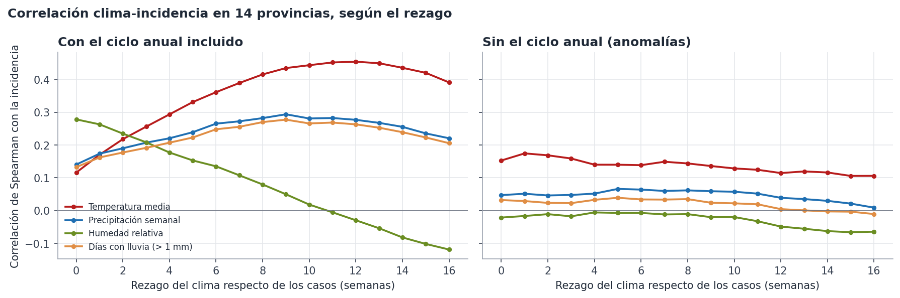
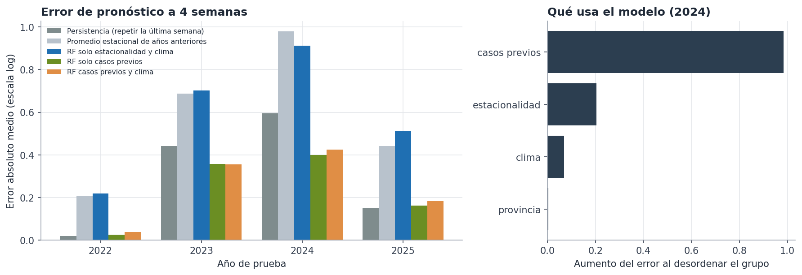
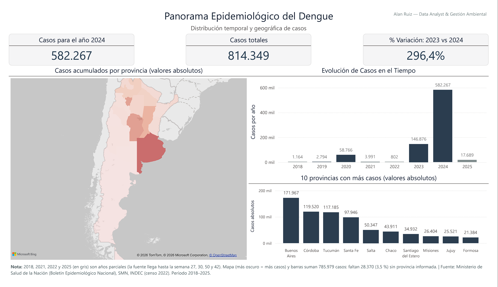
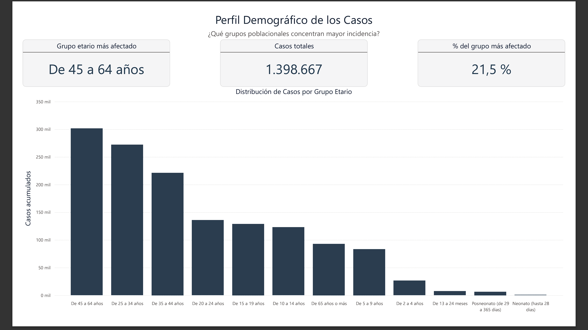
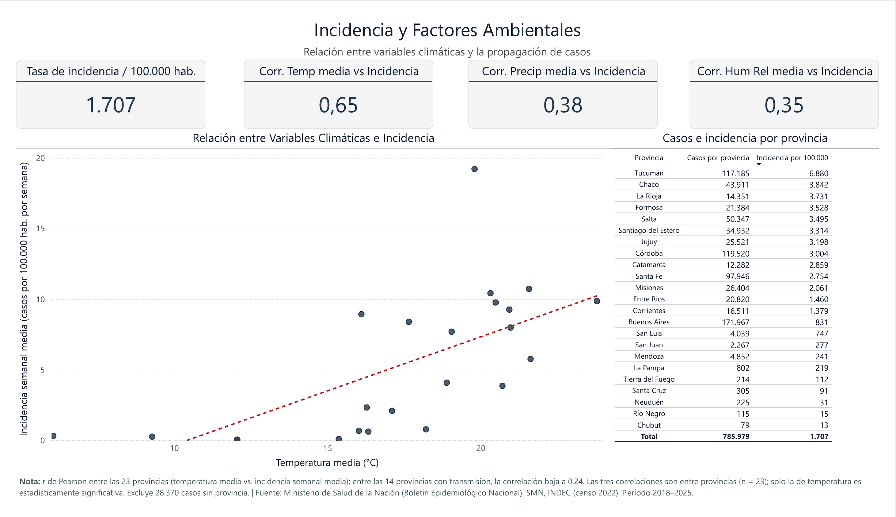
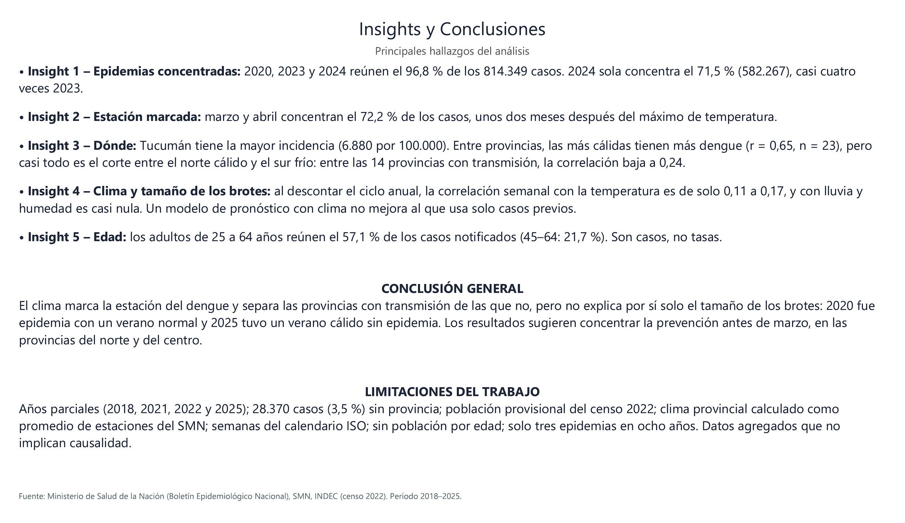

# 🦟 Dengue y clima en Argentina (2018–2025)
### Análisis de datos end-to-end: Python + SQL + Power BI

---

## 📌 Descripción

Este proyecto analiza el dengue en Argentina entre 2018 y 2025 y pone a prueba una pregunta concreta: **¿el clima explica cuándo ocurren los brotes y qué tan grandes son?** Para responderla cruza los casos notificados por semana epidemiológica con el clima real de cada provincia, semana a semana, construido a partir de los registros diarios de las estaciones del Servicio Meteorológico Nacional (SMN).

Se implementa un pipeline completo de datos (**end-to-end**) que incluye:

- Limpieza y validación de los casos, y construcción del clima provincial (Python)
- Modelado relacional y vistas analíticas (SQLite)
- Análisis de la relación clima-casos y pruebas de pronóstico con validación temporal (Python)
- Visualización e interpretación (Power BI)

---

## 📈 Resultados principales

- Entre 2018 y 2025 se notificaron 814.349 casos, pero no de forma pareja: las temporadas 2020, 2023 y 2024 concentran el 96,8 % y la de 2024 sola, el 71,5 %.
- La estación es muy marcada: marzo y abril reúnen el 72,2 % de los casos, unos dos meses después del máximo de temperatura.
- Tucumán tiene la mayor incidencia acumulada (6.880 casos por 100.000 habitantes), casi 1,8 veces la de Chaco (3.842). En casos absolutos encabezan Buenos Aires (171.967), Córdoba (119.520) y Tucumán (117.185).
- Los adultos de 25 a 64 años reúnen el 57,1 % de los casos notificados (no es una tasa por edad: la fuente no trae población por grupo etario).
- **El clima explica el *cuándo*, no el *cuánto*.** La correlación bruta entre temperatura e incidencia llega a ρ = 0,45 con unas 12 semanas de rezago, pero casi todo es el ciclo anual compartido. Al quitarlo, baja a ρ = 0,11–0,17. Humedad y lluvia quedan en torno a cero (entre −0,07 y 0,07).
- En un pronóstico a 4 semanas con validación temporal, lo que más ayuda son los casos recientes. Agregar clima no mejora el error: empata en 2023 y empeora en 2022, 2024 y 2025.
- Entre provincias, las más cálidas tienen más dengue (r = 0,65, n = 23), pero casi todo es el corte entre el norte cálido y el sur frío, sin dengue: entre las 14 provincias con transmisión, la correlación baja a r = 0,24.
- Entre temporadas, el calor no alcanza: 2020 tuvo epidemia con un verano de temperatura normal y 2025 tuvo un verano cálido sin epidemia.





---

## 🎯 Objetivos

- Describir la evolución temporal y territorial del dengue entre 2018 y 2025
- Construir el clima semanal y mensual de cada provincia a partir de datos diarios del SMN
- Medir la relación entre clima e incidencia sin confundirla con la estacionalidad
- Evaluar si el clima mejora un pronóstico de casos a 4 semanas
- Diseñar un dashboard interactivo para el análisis en BI

---

## 🔄 Metodología

**1. Limpieza de casos (Python, `notebook/01_limpieza_casos.ipynb`)**
- Lectura de 10 archivos del Boletín Epidemiológico, 2018–2025
- 2021 y 2024 aparecen en dos archivos cada uno, como versiones del mismo año: se conserva la más completa para no duplicar casos
- Normalización de provincias, departamentos y grupos de edad, cuyos identificadores cambian entre archivos
- Incidencia con la población del censo 2022 (INDEC, datos provisionales)

**2. Clima del SMN (Python, `notebook/02_clima_smn.ipynb`)**
- Registros diarios de 91 estaciones, con tratamiento del convenio del SMN: precipitación vacía = 0 mm y `S/D` = dato faltante
- Provincia = promedio simple de sus estaciones (CABA se suma a Buenos Aires)
- Semana válida con al menos 5 de 7 días y mes válido con al menos 80 % de los días
- Comparación contra las temperaturas medias de referencia

**3. Modelado de datos (SQLite, `notebook/03_modelado_sql.ipynb`)**
- Tabla de hechos casos + clima y panel completo provincia-semana, con ceros explícitos
- Trece vistas analíticas con funciones de ventana (`LAG`)
- Verificación de las vistas contra un cálculo independiente en pandas
- Exportación de la tabla de hechos y de cada vista a CSV en `powerbi/`, que es lo que carga el dashboard

**4. Clima y brotes (Python, `notebook/04_clima_y_brotes.ipynb`)**
- Exploración por año, semana, provincia y edad
- Correlación de Spearman con rezagos de 0 a 16 semanas, con y sin el ciclo anual
- Correlación entre provincias, con y sin las provincias sin transmisión
- Análisis entre temporadas y su sensibilidad a la definición de verano

**5. Pronóstico (Python, `notebook/05_pronostico.ipynb`)**
- Pronóstico a 4 semanas con bosques aleatorios y validación que respeta el tiempo (se entrena solo con años anteriores)
- Comparación contra dos referencias simples: repetir la última semana y el promedio estacional

**6. Visualización (Power BI)**
- Dashboard interactivo de cuatro páginas, con medidas DAX

---

## 📊 Dashboard (Power BI)

Power BI carga los CSV de [`powerbi/`](powerbi/), uno por tabla o vista de la base SQL. Los datos son un corte histórico que no cambia, así que no hace falta una conexión a la base ni un servidor. El dashboard se estructura en cuatro páginas:

- **Panorama epidemiológico**
- **Perfil demográfico**
- **Incidencia y factores ambientales**
- **Insights y conclusiones**

También está disponible en PDF: [`dashboard/reporte-dashboard-dengue.pdf`](dashboard/reporte-dashboard-dengue.pdf).

### 🖼️ Visualizaciones

#### Overview


#### Demografía


#### Factores ambientales


#### Insights


---

## 🗂️ Fuente de los datos

- **Casos:** Ministerio de Salud de la Nación, *Boletín Epidemiológico Nacional: Dengue y Zika*, publicado como datos abiertos en [datos.salud.gob.ar](https://datos.salud.gob.ar/dataset). Archivos 2018–2025 en `data/raw/`.
- **Clima:** Servicio Meteorológico Nacional, [datos meteorológicos diarios](https://www.smn.gob.ar/descarga-de-datos). Los dos archivos grandes (94 MB) no se versionan: la descarga se explica en [`data/raw/clima/LEEME.md`](data/raw/clima/LEEME.md).
- **Población:** Censo 2022 del INDEC, resultados provisionales, en `data/raw/poblacion_provincias_censo2022.csv`.
- **Coordenadas de las provincias:** están definidas dentro del modelo del dashboard (columnas calculadas de `vista_casos_por_provincia`) y las usa el mapa. Fuente por documentar.

---

## ⚠️ Limitaciones

- **Años parciales:** 2018, 2021, 2022 y 2025 no llegan a la semana 52 en la fuente y no deben compararse directamente con los años completos.
- **Casos sin provincia:** 28.370 casos (3,5 % del total) no tienen provincia en la fuente. Cuentan en los totales nacionales y quedan fuera de todo cálculo provincial.
- **Población provisional:** la incidencia usa los resultados provisionales del censo 2022. Cuando haya cifras definitivas, solo hay que reemplazar el archivo de población.
- **Clima provincial aproximado:** la provincia es el promedio simple de sus estaciones, un resumen grueso de condiciones que varían dentro de cada provincia. En Jujuy pesa la estación de La Quiaca, de gran altura.
- **Semanas ISO:** el calendario de semanas es el ISO, una aproximación de la semana epidemiológica oficial.
- **Sin población por edad:** los grupos de edad se comparan en porcentaje de casos notificados, no en riesgo.
- **Pocas temporadas:** con tres epidemias en ocho años, ninguna conclusión sobre el tamaño de un brote es firme. Los datos no incluyen inmunidad previa, serotipo circulante ni presencia del vector.

---

## 🚀 Cómo reproducirlo

Requiere Python 3.11 o superior (los notebooks se ejecutaron con 3.11) y Power BI Desktop solo para abrir el `.pbix`.

```bash
git clone https://github.com/alandruiz/vigilancia-dengue-argentina.git
cd vigilancia-dengue-argentina

python -m venv .venv
.venv\Scripts\activate          # en macOS/Linux: source .venv/bin/activate
pip install -r requirements.txt

jupyter lab
```

Abrí los notebooks desde la carpeta `notebook/` y ejecutalos en orden (*Restart & Run All*):

1. `01_limpieza_casos.ipynb` lee `data/raw/` y guarda los casos limpios en `data/interim/`.
2. `02_clima_smn.ipynb` construye el clima provincial en `data/processed/`. Necesita los archivos del SMN descriptos en [`data/raw/clima/LEEME.md`](data/raw/clima/LEEME.md); sin ellos, se puede seguir desde el notebook 03 con las tablas ya incluidas.
3. `03_modelado_sql.ipynb` crea `sql/dengue.db` y `sql/vistas_dengue.sql`, y exporta las tablas a `powerbi/`.
4. `04_clima_y_brotes.ipynb` y `05_pronostico.ipynb` generan los gráficos de `images/`.

Para abrir el dashboard hay que apuntar Power BI a la carpeta `powerbi/`: los pasos y las consultas están en [`powerbi/consultas_power_query.md`](powerbi/consultas_power_query.md).

---

## 📁 Estructura del repositorio

```
vigilancia-dengue-argentina/
├── dashboard/   dashboard de Power BI (.pbix) y su versión en PDF
├── data/
│   ├── raw/         archivos originales: casos, población y clima (ver LEEME)
│   ├── interim/     casos limpios
│   └── processed/   clima provincial y panel provincia-semana
├── images/      gráficos del análisis y capturas del dashboard
├── notebook/    01 casos, 02 clima SMN, 03 modelo SQL, 04 clima y brotes, 05 pronóstico
├── powerbi/     CSV de la tabla de hechos y de las vistas, que carga el dashboard
├── sql/         base SQLite (dengue.db) y vistas (vistas_dengue.sql)
├── LICENSE
├── readme.md
└── requirements.txt
```

---

## 💡 Próximos pasos

- Reemplazar la población provisional por las cifras definitivas del censo 2022
- Incorporar población por grupo etario para calcular incidencia específica por edad
- Probar modelos de series temporales por provincia
- Incorporar variables que expliquen el tamaño de un brote, como el serotipo circulante

---

## 📄 Licencia

El código se publica bajo licencia MIT (ver [`LICENSE`](LICENSE)). Los datos conservan las condiciones de sus fuentes (Ministerio de Salud, SMN e INDEC).

---

## 👤 Autor

**Alan Ruiz** — Data Analyst & Gestión Ambiental

- [LinkedIn](https://www.linkedin.com/in/alandruiz/)
- [GitHub](https://github.com/alandruiz/vigilancia-dengue-argentina)
